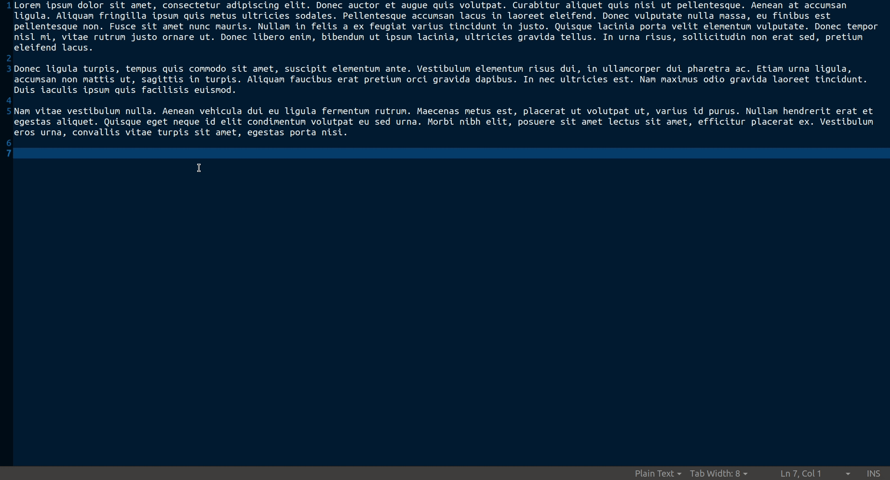
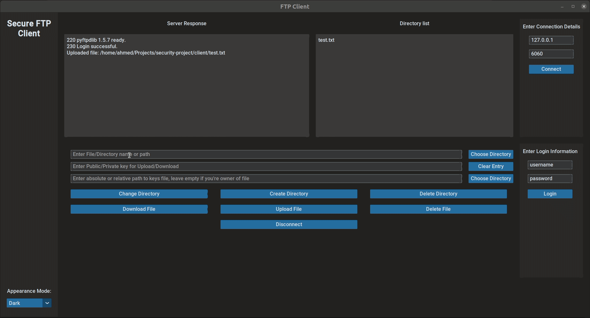

# Secure File Sharing using FTP and Hybrid Cryptography

This project aims to provide a secure platform for file sharing using the File Transfer Protocol (FTP) and hybrid cryptography. The secure FTP client encrypts data before sending it to the server and decrypt it on download given
a key

features:
- Encrypt and upload file to FTP server
- Download and decrypt files from FTP server given a private key
- Navigation and control of FTP file system

## Getting Started

### Prerequisites

- Python 3.8 or later

### Installing

#### Virtual environments

```bash
    $ python -m venv venv
    $ source ./venv/bin/activate
    $ . ./initialize_project.sh
```

#### Running Secure FTP Client

```bash
    $ python run.py
```

#### Running Local FTP Server
```bash
    $ python -m pip install python-ftp-server
    $ python -m python_ftp_server -u "username" -p "password" --ip 0.0.0.0 --port 6060 -d "home/temp/"
```

## Usage
### Upload Demo


### Download Demo



## Security

- The system uses hybrid cryptography for file protection using AES, DES, and BlowFish.
- The master key is encrypted using RSA.
- Secure key exchange using RSA outside the app

## License

This project is licensed under the GNU GPLv3 License - see the [LICENSE](LICENSE) file for details.
